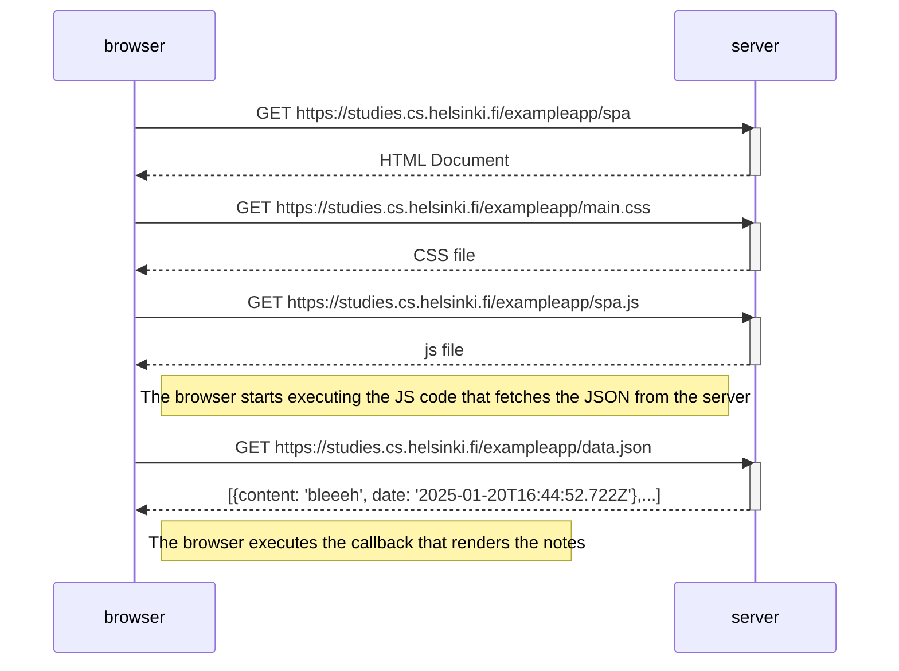

```mermaid
    sequenceDiagram
    participant browser
    participant server

browser->>server: GET https://studies.cs.helsinki.fi/exampleapp/spa
    activate server
server-->>browser: HTML Document
    deactivate server

browser->>server: GET https://studies.cs.helsinki.fi/exampleapp/main.css
    activate server
server-->>browser: CSS file
    deactivate server

browser->>server: GET https://studies.cs.helsinki.fi/exampleapp/spa.js
    activate server
server-->>browser: js file
    deactivate server

Note right of browser: The browser starts executing the JS code that fetches the JSON from the server

browser->>server: GET https://studies.cs.helsinki.fi/exampleapp/data.json
    activate server
server-->>browser: [{content: 'bleeeh', date: '2025-01-20T16:44:52.722Z'},...]
    deactivate server

Note right of browser: The browser executes the callback that renders the notes
```
